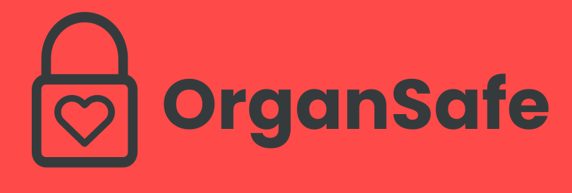

#  OrganSafe  

OrganSafe is a revolutionary web application that tackles the growing health problem of management of organ donations. Users can register on OrganSafe with their health information and desired donation and then application's algorithms will automatically match the users based on qualifying priority for available donations. Hospitals can easily track donations of organs and easily record when recipients recieve their donation. The verification of organ recipients is powered by the Ethereum Blockchain to provide critical security and prevent improper allocation for such a pivotal resource.

Developed for [TreeHacks 2022](https://www.treehacks.com/).

## 📝Authors 📝

Developed by the OrganSafe team: Benson Liu, Yash Gupta, Zach Tepper, & Zeyu Wang.

## 💻 Languages & Tools 💻

OrganSafe was developed using the following technlogies:
- Javascript 
- React.js 
- Python 
- Flask 
- Solidity 
- Ethereum Blockchain 
